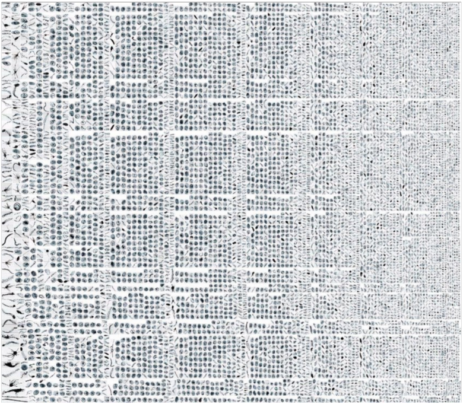

# PlanktoShare Classifier
[[`paper`](https://doi.org/10.5194/essd-2026-215)]
[[`dataset`](https://zenodo.org/records/19119233)]

> The PlanktoShare classifier predicts different plankton and non-plankton classes from data captured by the Plankton Imager ([PI-10](https://www.planktonanalytics.com/)) sensor. 



## Getting Started
### Data set-up
1. Download model weights from PLACEHOLDER. Two options are available, the `ResNet50-detailed` being more extensive with 49 different possible classifications, and the `OSPAR` model predicting 12 classes. Store these into `/models/`
2. Store your raw, unaltered Pi10-data into a preferable location. We recommend storing it in `/data/`, but can be stored in any accessible location using the argument `--source_dir`
3. For map creation, download the "EEA coastline for analysis" from the [European Environment Agency](https://www.eea.europa.eu/en/datahub/datahubitem-view/af40333f-9e94-4926-a4f0-0a787f1d2b8f). Store into `/data/`
4. For map creation, download the "Marine and land zones: the union of world country boundaries and EEZ's (version 4)" from [Marineregions.org](https://www.marineregions.org/downloads.php#unioneezcountry). Store into `/data/`


### Anaconda set-up
```
# install the repository
git clone git@github.com:geoJoost/planktoshare.git

# Setup the environment
conda create --name plankton_imager

conda activate plankton_imager

conda install pip

pip install fastai

# IMPORTANT: Modify this installation link to the correct CUDA/CPU version
# Check the CUDA version using `nvidia-smi` in the command-line
# If no CUDA is available, use the CPU installation; Be aware that this is significantly slower and discouraged for larger datasets
# See: https://pytorch.org/get-started/locally/
pip3 install torch torchvision torchaudio --index-url https://download.pytorch.org/whl/cu118

conda install -c conda-forge pandas numpy polars seaborn xlsxwriter chardet geopandas python-docx memory_profiler pyarrow fiona pyproj
```

### Usage
```
# To start the entire pipeline, navigate to your working directory
cd PATH/TO/WORKING_DIRECTORY

# Run the classifier
# See options below
# Not implemented yet
python main.py --source_dir data/YOUR_DATA_PATH --model_name ResNet50-detailed --cruise_name SURVEY_NAME --batch_size 300

# For more detailed options, see `main.py`
```

Options available in `main.py`:
* `source_dir`: This should be the path to your data folder directly from the Pi-10. It is recommended to store this within the repository in `/data/`.
* `model_name`: This corresponds to the model to use for inference. Options available are: `ospar` to use the OSPAR classifier (12 classes), or `ResNet50-detailed` to use the ResNet50 model which predicts 49 different plankton and non-plankton classes.
* `cruise_name`: This is used for intermediate outputs and for generating the final report. Any string is accepted without any spaces in the name, use '-' or '_' instead.
* `batch_size`: Number of samples to use within `inference.py`. This is highly dependent on the available memory within your PC/HPC. Default value of 32 is recommended for local machines. 

## Dataset Requirements
Use the original dataset structure as provided by the PI-10 imager without modifications.

### Raw
```
CRUISE_NAME
├── 2024-06-24
│   ├── 1454.tar
│   ├── 1458.tar
│   ├── 1459.tar
│   ├── 1500.tar
│   ├── 1510.tar
│   ├── 1520.tar
│   ├── 1530.tar
│   ├── 1540.tar
│   ├── 1550.tar
│   ├── 1600.tar
│   ├── 1610.tar
│   ├── 1620.tar
│   ├── 1630.tar
│   └── 1640.tar
├── 2024-06-25
│   ├── 0000.tar
│   ├── 0010.tar
│   ├── 0020.tar
│   ├── 0030.tar
│   ├── 0040.tar
│   ├── 0050.tar
│   ├── 0100.tar
│   ├── 0110.tar
```
### Untarred
```
CRUISE_NAME_UNTARRED
├── 2024-06-24
│   ├── untarred_1454
│   │   ├── Background.tif
│   │   ├── Bubbles.txt
│   │   ├── Cameralog.txt
│   │   ├── HitsMisses.txt
│   │   ├── RawImages\pia7.2024-06-24.1454+N00000000.tif
│   │   ├── RawImages\pia7.2024-06-24.1454+N00000001.tif
│   │   ├── RawImages\pia7.2024-06-24.1454+N00000002.tif
│   │   ├── RawImages\pia7.2024-06-24.1454+N00000003.tif
│   │   ├── RawImages\pia7.2024-06-24.1454+N00000004.tif
```

## Inference Pipeline

The PlanktoShare repository automates the processing of PI-10 data using custom classifiers. The inference script performs the following steps:
1. Iterate through directory to process each `.tar` file.

2. Temporarily extracts all `.tif` images from each `.tar`.

3. Uses the classifier defined by the `model_name` argument to classify images.

4. Detects and discards corrupted images.

5. Generate outputs
   For each 10-minute bin, creates:
   - **Detailed CSV**: Includes per-image metadata:
     - Image details (filename, datetime, EXIF geodata)
     - Cruise information (cruise name, instrument code)
     - Model predictions (class ID/label, confidence scores)
   - **Summarized CSV**: Provides aggregated statistics:
     - Total predicted images per class
     - Density and summary statistics (e.g., average confidence)

6. Stratified random sampling (n=100) per class for manual validation and creating training data.

7. Automatically generates a summary report (examples in `/reports/`).

## Training
To train new models, organize your training dataset as follows:

```bash
data/PlanktoShare/
├── Crustacea_Copepoda_Calanoida/
│   ├── img_0001.tif
│   ├── img_0002.tif
│   └── ...
├── Detritus/
│   ├── img_0001.tif
│   └── ...
├── Myzozoa_Dinophyceae/
│   └── ...
├── Echinodermata_Echinoidea-larvae/
│   └── ...
├── Crustacea_Cladocera/
│   └── ...
└── .../
```

Run the training script from the command line using the following arguments:

```bash
python train.py \
    --model_name PlanktoShare \
    --model_type ResNet50 \
    --train_dataset data/PlanktoShare \
    --batch_size 32
```


## Future implementations
* Remove FastAI implementation

## Known errors
* Error in `learn.load(MODEL_FILENAME, weights_only=False)` can be caused in older PyTorch versions. In this case, simply remove the `weights_only` argument.

---
If you use this code or dataset, please cite our paper. For questions, feedback, or collaborations, feel free to contact us.
